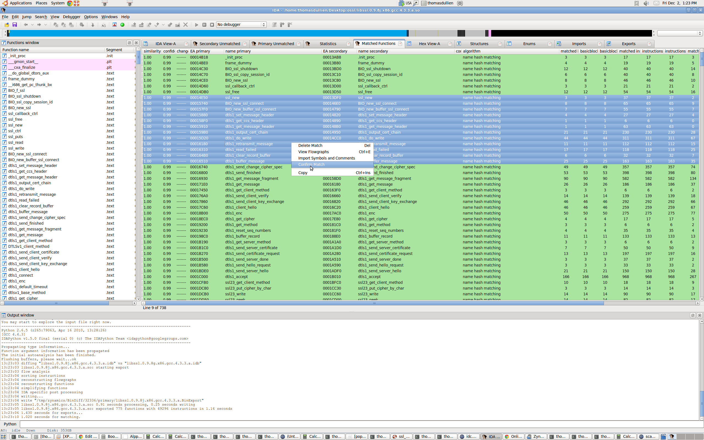
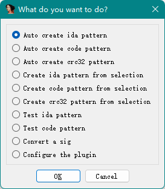

# Binary Code Matching
- [BinDiff](https://www.zynamics.com/software.html)  
  

  Disadvantages:
  - Does not support IDB paths with non-ASCII characters

- [SigMaker](https://github.com/ajkhoury/SigMaker-x64)  
  

  Disadvantages:
  - Does not output multiple signatures for one function
  - Does not output matching results when generating signatures

- [SigMakerEx](https://github.com/kweatherman/sigmakerex)  
  

## Library signatures
Full:
- [Library Signatures](https://github.com/Chaoses-Ib/library-signatures)